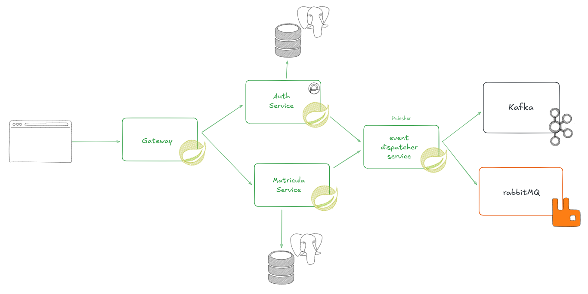

# 📚 Plataforma de Matrícula – Arquitectura de Microservicios

Este proyecto implementa un sistema de **gestión de matrículas** para una plataforma educativa.  
Permite **asignar estudiantes a cursos**, y cada evento importante se envía al **Event Dispatcher**, que publica los mensajes en **RabbitMQ** (para notificaciones como correos) y en **Kafka** (para logs y auditoría).

La arquitectura está desarrollada con **Spring Boot**, **DDD**, **Arquitectura Hexagonal** y **Comunicación Asíncrona**.

---

# 🏛️ Arquitectura General

La arquitectura combina un **API Gateway** como punto central de entrada, servicios desacoplados y un sistema de mensajería distribuida.



### 🔁 Flujo Principal

1. **Cliente (Frontend / Postman)**  
   Realiza todas las solicitudes a través del Gateway.

2. **API Gateway (`gateway-service`)**  
   - Rutas públicas como `/auth/login` pasan directamente.  
   - Rutas protegidas requieren `Authorization: Bearer <jwt>`.  
   - No valida firmas, solo controla acceso.  
   - Redirige según el path al microservicio correspondiente.

3. **Servicios de Dominio**
   - `auth-service`: login, registro, generación de tokens.  
   - `matricula-service`: inscripción y desinscripción de estudiantes.  
   Cada servicio valida localmente el JWT siguiendo el principio **Zero-Trust**.

4. **Event Dispatcher (`event-dispatcher-service`)**  
   - Recibe un evento HTTP desde los servicios.  
   - Decide si publicar en **Kafka**, en **RabbitMQ**, o ambos.  
   - Actúa como *publisher centralizado*.

5. **Brokers**
   - **RabbitMQ**: eventos para acciones inmediatas (envío de email).  
   - **Kafka**: logs del sistema, auditoría, event streaming.

6. **Consumidores**
   - `notification-service`: escucha de RabbitMQ y envía correos.  
   - `kafka-service`: escucha de Kafka para análisis o persistencia.

---

# ⚙️ Tecnologías Utilizadas

| Categoría | Tecnología |
|----------|------------|
| **Backend** | Java 17, Spring Boot 3.x |
| **Gateway** | Spring Cloud Gateway |
| **Seguridad** | JWT, Spring Security |
| **DDD / Hexagonal** | Ports & Adapters, Domain-Driven Design |
| **Mensajería** | RabbitMQ, Kafka (Confluent) |
| **Bases de Datos** | PostgreSQL |
| **Orquestación** | Docker & Docker Compose |
| **CI/Build Tools** | Maven, Makefile |

---

# 📦 Microservicios y Roles

| Servicio | Descripción |
|---------|-------------|
| **gateway-service** | Punto de entrada; enruta peticiones y filtra autenticación |
| **auth-service** | Manejo de usuarios, login y generación de JWT |
| **matricula-service** | Inscripción/desinscripción de estudiantes |
| **event-dispatcher-service** | Publica eventos hacia Kafka y RabbitMQ |
| **notification-service** | Envía correos a partir de eventos de RabbitMQ |
| **kafka-service** | Procesador de eventos provenientes de Kafka |
| **Postgres DBs** | Bases separadas por contexto (`auth` y `matricula`) |
| **RabbitMQ / Kafka** | Mensajería asíncrona |

---

# 🧪 Endpoints Principales

### Auth Service (vía Gateway)
```

POST /auth/login
POST /auth/register

```

### Matrícula (vía Gateway)
```

POST /api/matricula/assign
POST /api/matricula/unassign
GET  /api/matricula/courses
...

````

---

# 🚀 Cómo Levantar Todo con Docker Compose

El proyecto ya incluye un `docker-compose.yml` con toda la infraestructura y microservicios.

### 1. Clonar el repositorio
```bash
git clone [https://github.com/tuproject/microservices-matricula.git](https://github.com/SebastianLl28/microservices/tree/master)
cd microservices
````

### 2. Configurar variables de entorno

Crear el archivo `.env`:

```env
#example
DB_USER=postgres
DB_PASSWORD=postgres
MATRICULA_DB_NAME=matricula_db
AUTH_DB_NAME=auth_db

# ==================== RABBITMQ ====================
RABBITMQ_USER=rabbituser
RABBITMQ_PASS=rabbitpass
RABBITMQ_PORT=15672

# ==================== KAFKA ====================
KAFKA_PORT=9092

# ==================== PUERTOS DE SERVICIOS ====================
MATRICULA_SERVICE_PORT=8000
AUTH_SERVICE_PORT=8001

# ==================== JWT CONFIGURATION ====================
JWT_SECRET=
JWT_EXPIRATION=86400000

# ==================== EMAIL CONFIGURATION ====================
# Configuración para el notification-service
MAIL_HOST=sandbox.smtp.mailtrap.io
MAIL_PORT=2525
MAIL_USERNAME=
MAIL_PASSWORD=

SPRING_PROFILES_ACTIVE=docker

```

### 3. Construir los servicios

```bash
docker compose build
```

### 4. Levantar infraestructura + microservicios

```bash
docker compose up -d
```

### 5. Verificar servicios

```bash
docker compose ps
```

### 6. Detener todo

```bash
docker compose down
```

---

# 🔧 Uso del Makefile (Opcional pero recomendado)

Incluye comandos rápidos para desarrollo:

| Comando            | Acción                                   |
| ------------------ | ---------------------------------------- |
| `make up`          | Levanta infraestructura + microservicios |
| `make down`        | Detiene todo                             |
| `make build`       | Construye todas las imágenes             |
| `make logs-gw`     | Ver logs del gateway                     |
| `make restart-mat` | Reinicia servicio de matrícula           |
| `make rebuild-eds` | Reconstruye el dispatcher                |

### Levantar todo con un solo comando

```bash
make dev
```

### Ver logs de un servicio

```bash
make logs-mat
```

### Reconstruir solo un microservicio

```bash
make rebuild-auth
```

---

# 🖥️ Instalar `make` en Windows (Opcional)

Windows no trae `make` por defecto.
Opciones:

### **1. Instalarlo vía Chocolatey**

```bash
choco install make
```

### **2. Instalar Make a través de Scoop**

```bash
scoop install make
```

### **3. Usar Git Bash**

Git Bash incluye una versión funcional de `make`.

---

# 🔍 Paneles de Observabilidad

| Servicio             | URL Local                                        |
| -------------------- | ------------------------------------------------ |
| **API Gateway**      | [http://localhost:8080](http://localhost:8080)   |
| **RabbitMQ (UI)**    | [http://localhost:15672](http://localhost:15672) |
| **Kafka UI**         | [http://localhost:8090](http://localhost:8090)   |
| **Event Dispatcher** | [http://localhost:8082](http://localhost:8082)   |

---

# 📬 ¿Qué hace el Sistema de Matrícula?

✔ Asigna un estudiante a un curso
✔ Desasigna estudiantes
✔ Genera un evento de dominio
✔ Envía el evento al **Dispatcher**
✔ Dispatcher publica en **RabbitMQ** (email)
✔ Dispatcher publica en **Kafka** (logs)
✔ Notificador envía correo
✔ Kafka-Service registra el evento para análisis

---

# 🧩 Próximas Extensiones Posibles

* Registro de auditoría avanzado
* Implementación de API externa para notificaciones
* Métricas en Prometheus + Grafana
* Versionado de eventos (Event Sourcing)

